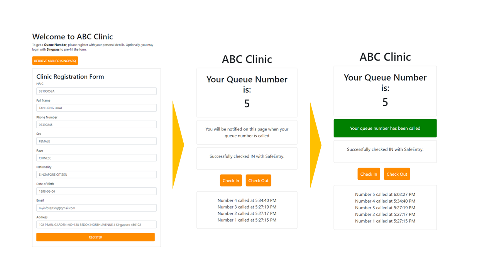
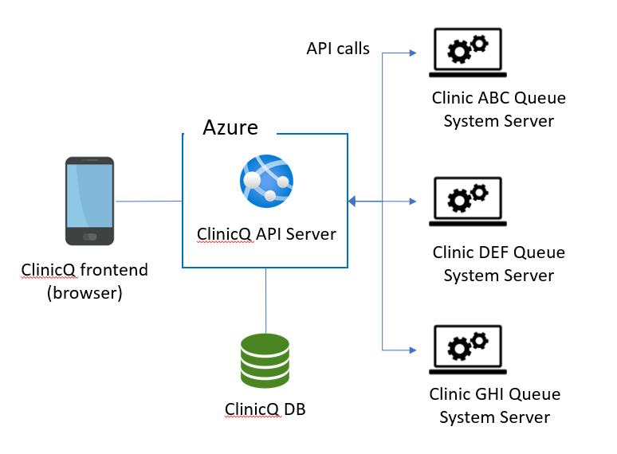
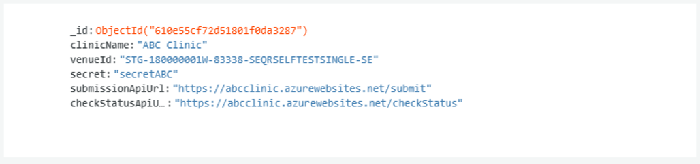
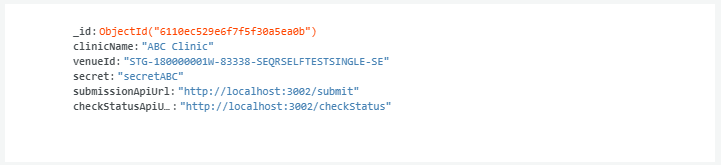

# ClinicQ Application

- [ClinicQ Application](#clinicq-application)
  * [Architecture](#architecture)
  * [Using ClinicQ](#using-clinicq)
  * [Deployment](#deployment)
  * [Local Development Setup](#local-development-setup)
    + [Setup Steps](#setup-steps)
      - [1. Set up simulated clinic server](#1-set-up-simulated-clinic-server)
      - [2. Set up MonogDB Database](#2-set-up-monogdb-database)
      - [3. Set up Environment Variables](#3-set-up-environment-variables)
      - [4. Set up ClinicQ application](#4-set-up-clinicq-application)
  * [Environment Variables](#environment-variables)
  * [Database Setup](#database-setup)
  * [API](#api)
    + [Browser Facing](#browser-facing)
      - [```GET /checkStatus<venueId>/<nric>/<number>```](#get-checkstatusvenueidnricnumber)
      - [```GET /myInfoEnv```](#get-myinfoenv)
      - [```POST /person```](#post-person)
      - [```POST /submit```](#post-submit)
      - [```POST /safeEntry```](#post-safeentry)
    + [Clinic Facing](#clinic-facing)
      - [```POST /callNumber```](#post-callnumber)

<small><i><a href='http://ecotrust-canada.github.io/markdown-toc/'>Table of contents generated with markdown-toc</a></i></small>



*ClinicQ* is designed to act as a patient-facing frontend service for the queue management systems of clinics.
After onboarding with the ClinicQ system, the clinic's patients would be able to enjoy:

1. Pre-filling of the clinic registration form using *Singpass*
2. Automated checking in for SafeEntry
3. Clinic queue status updates and queue number notifications

For clinics, they can easily on-board their existing queue / registration systems to make use of the ClinicQ web API to deliver this experience.
For more details on onboarding, see the included [PowerPoint](docs/ClinicQ_Application.pptx).

This project uses the *MyInfo Person API* and *SafeEntry API* from *Singpass* to enable its form pre-filling and SafeEntry check in / out capabilities.

For development convenience, this repository works with a simulated clinic server over at [this repository](https://github.com/pickledbees/clinic_sim)

## Architecture
ClinicQ is designed to act as a patient-facing frontend service for clinic queue management systems.
The ClinicQ API Server is responsible for serving the relevant UI pages, as well as sending patient data submissions to the appropriate clinic queue management systems servers by calling their exposed web APIs. In turn, ClinicQ has exposed web APIs for clinics to call.
The exposed API information of each clinic is maintained in a noSQL database (MongoDB).
The implementation of ClinicQ API Server is stateless and can be replicated to scale up or down as needed.



## Using ClinicQ
This project comes with a [PowerPoint](docs/ClinicQ_Application.pptx) demonstrating the usage of ClinicQ under the *ClinicQ Usage (Storyboard)* section.

In real-life deployment, users access the ClinicQ application by scanning a QR code located at the clinic. To access the publicly deployed **demo** instance, you may scan this:

**NOTE**: The demo instance is **not registered** under Singpass and does not have the necessary permissions to use a custom callback URL,
as such, the pre-fill form feature **will not work**. To use that feature, consider using a local deployment instead. (see [Local Development Setup](#local-development-setup))


For development purposes with the ClinicQ application deployed at ```localhost:3001```, use this:


They essentially point to ```/form?venueId=<venueId>``` where ```<venueId>``` is the clinic's registered venue ID under SafeEntry.


## Deployment
This project comes included with start scripts that set the necessary environment variables for operation, as well as to start the application.
For more details on the environment variables used, see [Environment Variables](#environment-variables).

- Windows: [start.bat](start.bat)
- Linux: [start.sh](start.sh)

This application also requires a database, and a functioning clinic server to work.
- You may find a demo clinic server built for simulating this in this [repository](https://github.com/pickledbees/clinic_sim).
- See this [section](#database-setup) for more details on database setup.

For **demo** purposes, an instance of ClincQ and the simulated clinic server has been publicly deployed on Azure App Service as web applications;
both projects use Github Actions to perform CD to the App Service. The workflow ```.yml``` files can be found [here](.github/workflows/main_clinicq.yml).
A database used for this demo has also been set up.

## Local Development Setup
The application uses a simple NodeJS backend built on the ExpressJS framework and serves pages rendered with the EJS templating engine.
The NodeJS version used during development was v10.11.0. For hot-reloads on code changes, it is recommended to use nodemon.
The application server itself is stateless and uses a connected MongoDB database to store information.  

### Setup Steps
To develop locally, 3 components need to run:
- A clinic server
- The ClinicQ application
- A MongoDB database used by ClinicQ.

#### 1. Set up simulated clinic server
Refer to this [repository](https://github.com/pickledbees/clinic_sim) for setup details.

#### 2. Set up MonogDB Database
Refer to [Database Setup](#database-setup) for setup details.

#### 3. Set up Environment Variables
Refer to [Environment Variables](#environment-variables) for details.

#### 4. Set up ClinicQ application
- Install [NodeJS](https://nodejs.org/en/) if not already installed. Any version >10.11.0 should work.
- In the root directory, run ```npm install``` to install dependencies
- Install [nodemon](https://www.npmjs.com/package/nodemon) globally: ```npm install -g nodemon```
- Start the application in development mode: ```npm run dev```

The clinicQ application is then deployed locally listening on port 3001 by default. On successful startup, you should see this:
```
[nodemon] starting `node app.js`
clinic Q system listening on 3001
```

You can now access a Form Page at ```http://localhost:3001/form?venueId=STG-180000001W-83338-SEQRSELFTESTSINGLE-SE```

## Environment Variables
The ClinicQ Application uses the following environment variables in its execution.
For **deployment**, edit [start.bat](start.bat) or [start.sh](start.sh). For **development** edit [startdev.bat](startdev.sh).

**NOTE**: For ```MYINFO_APP_REDIRECT_URL```, the format should be ```<protocol>://<apphostname>/callback```.

| Variable                    | Description                                                                                                                    |
|-----------------------------|--------------------------------------------------------------------------------------------------------------------------------|
| PORT                        | The port for the server to listen on. Not necessary for deployment in container environments                                   |
| PRIVATE_KEY_PATH            | Relative path from root directory to private key (.pem format)                                                                 |
| PUBLIC_CERT_PATH            | Relative path from root directory to public cert (.cer format)                                                                 |
| MYINFO_APP_CLIENT_ID        | Client ID for registered MyInfo application                                                                                    |
| MYINFO_APP_CLIENT_SECRET    | Client Secret for registered MyInfo application                                                                                |
| MYINFO_APP_REDIRECT_URL     | Redirect URL after authorization from Singpass, used to call application server to serve page with authcode                    |
| MYINFO_API_AUTHORISE        | MyInfo Authorize API URL for redirecting user to MyInfo Authorize Portal to authorize use of personal information from MyInfo  |
| MYINFO_API_TOKEN            | MyInfo Token API URL, called to fetch MyInfo Token for MyInfo requests after receiving authcode                                |
| MYINFO_API_PERSON           | MyInfo Person API URL, called with token to fetch personal data from MyInfo                                                    |
| MYINFO_ATTRIBUTES           | Attributes requested from MyInfo Person API. DO NOT MODIFY unless source code is modified to use a different set of attributes |
| SAFEENTRY_APP_CLIENT_ID     | Client ID for registered SafeEntry application                                                                                 |
| SAFEENTRY_APP_CLIENT_SECRET | Client Secret for registered SafeEntry application                                                                             |
| SAFEENTRY_API               | SafeEntry API URL, called to check in / out of SafeEntry                                                                       |
| MONGODB_URL                 | Connection string of MongoDB cluster                                                                                           |
| MONGODB_COLLECTION          | Name of collection storing clinic information                                                                                  |
| MONGODB_DB                  | Name of MongoDB database containing MONGODB_COLLECTION      


## Database Setup
ClinicQ queries for API information and other clinic related information from a database during operation, thus the clinic will have to insert its API information (and other relevant details) into the database.
The prototype uses MongoDB (noSQL document-based). Below is a sample clinic document stored in a database collection:



- ```clinicName``` is used by ClinicQ to display the appropriate clinic's name in the Form Page and the Queue Page
- ```venueId``` is used to identify the clinic (key)
- ```secret``` is used during the ```POST: /callNumber``` call to "verify" that the caller is the clinic.
- ```submissionApiUrl``` is used by clinicQ to send registration form data to the clinic
- ```checkStatusApiUrl``` is used by clinicQ to check the status of patient in the queue by NRIC and queue number

**For development / local deployment purposes**, change ```submissionApiUrl``` and ```checkStatusApiUrl``` to point to the simulated clinic server APIs.

If you are using the simulated clinic server and its default settings at this [repository](https://github.com/pickledbees/clinic_sim), the following document will do:



The ```_id``` attribute is trivial and not relevant to the operation of the ClinicQ prototype.

## API
### Browser Facing

#### ```GET /checkStatus<venueId>/<nric>/<number>```
Gets the status of the patient given a venueId, NRIC and queue number. 

Sample response (200):
```json
{
  "status": 1,
  "lastCalled": [
    {
      "number": 89,
      "time": 1628656417429
    },
    {
      "number": 101,
      "time": 1628656404064
    },
    {
      "number": 100,
      "time": 1628656355219
    }
  ]
}
```
```status```: status of the patient in the queue.
- ```0```: In queue, number not called yet.
- ```1```: In queue, number called.
- ```2```: Not in queue anymore (either completed appointment or not registered yet)

```lastCalled```: list of recently called numbers.

#### ```GET /myInfoEnv```
Gets some environment variables of ClinicQ application related to MyInfo API.

Sample response (200):
```json
{
  "clientId": "STG2-MYINFO-SELF-TEST",
  "redirectUrl": "http://localhost:3001/callback",
  "authApiUrl": "https://test.api.myinfo.gov.sg/com/v3/authorise",
  "attributes": "uinfin,name,sex,race,nationality,dob,email,mobileno,regadd"
}
```

#### ```POST /person```
Gets person data from MyInfo Person API using authorization code retrieved from Singpass authorization process.

Sample Request:
```json
{
  "authCode": "11a5744f3e31d4e6273c94511c6e3648c4c9147c"
}
```
Sample Response (200)
```json
{
    "uinfin":{
      "lastupdated":"2021-06-24",
      "source":"1",
      "classification":"C",
      "value":"S3100052A"
    },
    "name":{
      "lastupdated":"2021-06-24",
      "source":"1",
      "classification":"C",
      "value":"TAN HENG HUAT"
    },
    "sex":{
      "lastupdated":"2021-06-24",
      "code":"F",
      "source":"1",
      "classification":"C",
      "desc":"FEMALE"
    },
    "race":{
      "lastupdated":"2021-06-24",
      "code":"CN",
      "source":"1",
      "classification":"C",
      "desc":"CHINESE"
    },
    "nationality":{
      "lastupdated":"2021-06-24",
      "code":"SG",
      "source":"1",
      "classification":"C",
      "desc":"SINGAPORE CITIZEN"
    },
    "dob":{
      "lastupdated":"2021-06-24",
      "source":"1",
      "classification":"C",
      "value":"1998-06-06"
    },
    "email":{
      "lastupdated":"2021-06-24",
      "source":"4",
      "classification":"C",
      "value":"myinfotesting@gmail.com"
    },
    "mobileno":{
      "lastupdated":"2021-06-24",
      "source":"4",
      "classification":"C",
      "areacode":{
        "value":"65"
      },
      "prefix":{
        "value":"+"
      },
      "nbr":{
        "value":"97399245"
      }
    },
    "regadd":{
      "country":{
        "code":"SG",
        "desc":"SINGAPORE"
      },
      "unit":{
        "value":"128"
      },
      "street":{
        "value":"BEDOK NORTH AVENUE 4"
      },
      "lastupdated":"2021-06-24",
      "block":{
        "value":"102"
      },
      "source":"1",
      "postal":{
        "value":"460102"
      },
      "classification":"C",
      "floor":{
        "value":"09"
      },
      "type":"SG",
      "building":{
        "value":"PEARL GARDEN"
      }
    }
}
```
The response follows the person schema from MyInfo API, refer to the official [documentation](https://public.cloud.myinfo.gov.sg/myinfo/api/myinfo-kyc-v3.2.0.html) for more information.

#### ```POST /submit```
Submits form data to ClinicQ server so ClinicQ server can send to the appropriate clinic.

Sample request:
```json
{
  "nric": "S3100052A",
  "name": "TAN HENG HUAT",
  "mobileno": "97399245",
  "sex": "FEMALE",
  "race": "CHINESE",
  "nationality": "SINGAPORE CITIZEN",
  "dob": "1998-06-06",
  "email": "myinfotesting@gmail.com",
  "regadd": "102 PEARL GARDEN #09-128 BEDOK NORTH AVENUE 4 Singapore 460102",
  "venueId": "STG-180000001W-83338-SEQRSELFTESTSINGLE-SE"
}
```
Sample Response (200):
```json
{
  "redirect": "/queue",
  "nric": "S3100052A",
  "mobileno": "97399245",
  "number": 89,
  "venueId": "STG-180000001W-83338-SEQRSELFTESTSINGLE-SE"
}
```
#### ```POST /safeEntry```
Calls ClinicQ server to call SafeEntry to perform check in / out

Sample Request:
```json
{
  "subType": "uinfin",
  "actionType": "checkin",
  "sub": "S3100052A",
  "venueId": "STG-180000001W-83338-SEQRSELFTESTSINGLE-SE",
  "mobileno": "97399245"
}
``` 
Sample Response (201):
```json
{
  "message":"safe entry checkin successful"
}
```
### Clinic Facing
#### ```POST /callNumber```
Calls ClinicQ server to notify the appropriate patient based on queue number and venue ID. Clinic must also supply
a list of recently called numbers in the request.

Sample Request:
```json
{
  "number": 89,
  "venueId": "STG-180000001W-83338-SEQRSELFTESTSINGLE-SE",
  "lastCalled": [
    {
      "number": 89,
      "time": 1628656417429
    },
    {
      "number": 101,
      "time": 1628656404064
    },
    {
      "number": 100,
      "time": 1628656355219
    }
  ],
  "secret": "secretABC"
}
```
Sample Response (200):
```
No body is sent in the response
```
